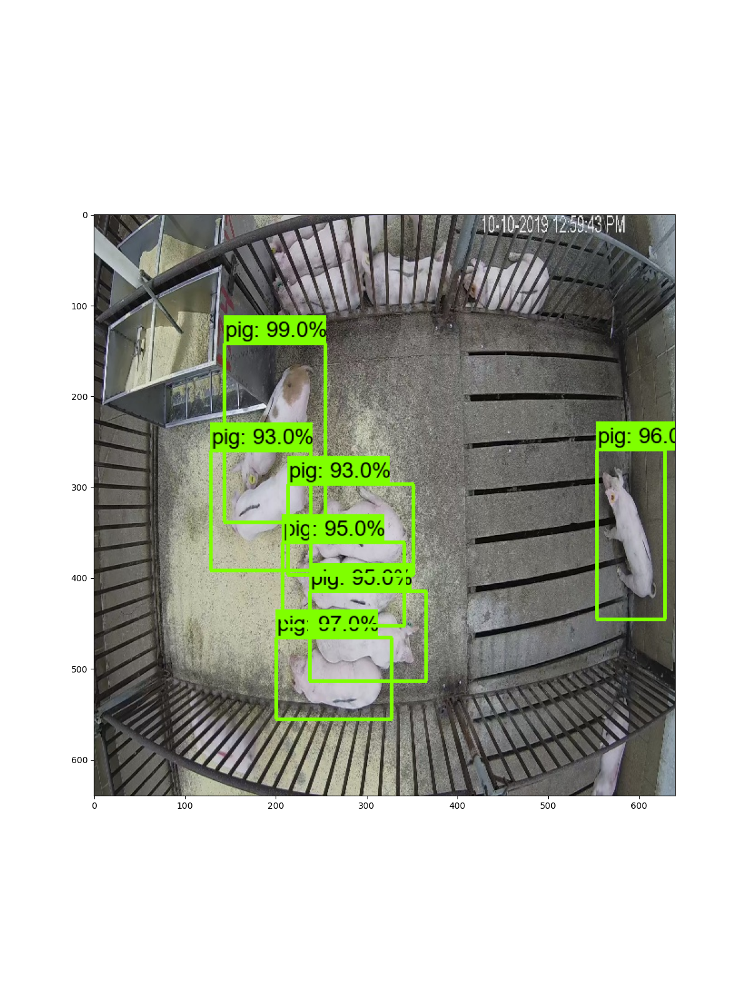

# Farm Animal Tracking Project

Project for tracking farm animals.

## Dataset

Dataset for learning of model can be obtained at [PSRG website](psrg.unl.edu/Projects/Details/12-Animal-Tracking).

## Model

1. To download precompiled model weights [Google Drive](https://drive.google.com/file/d/1OCkqrhT4LPlL4omqDQiw0_XzJ2J77F4n/view?usp=sharing)
1. Copy zip file into `./` directory
1. Run:

```
$ unzip zxvf inference_graph.tar.zip -d model
```

## Detection

To visualize animal detection on video use:
```
$ python show_prediction
```
or for image:
```
$ python run_detection.py
```

