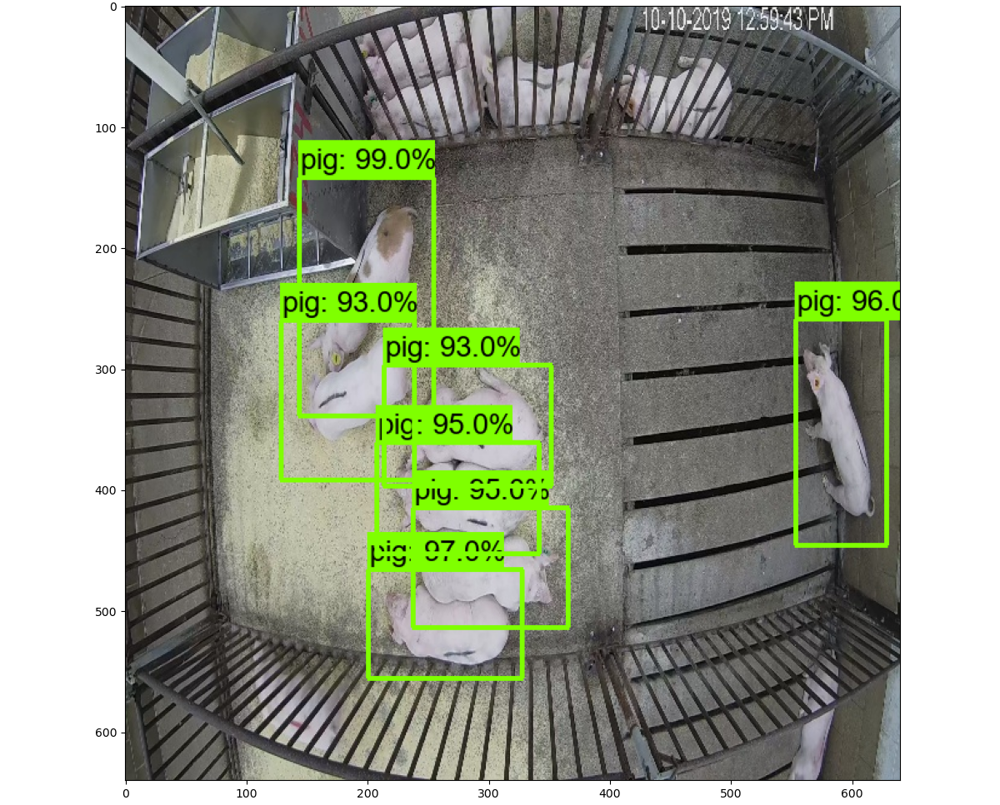
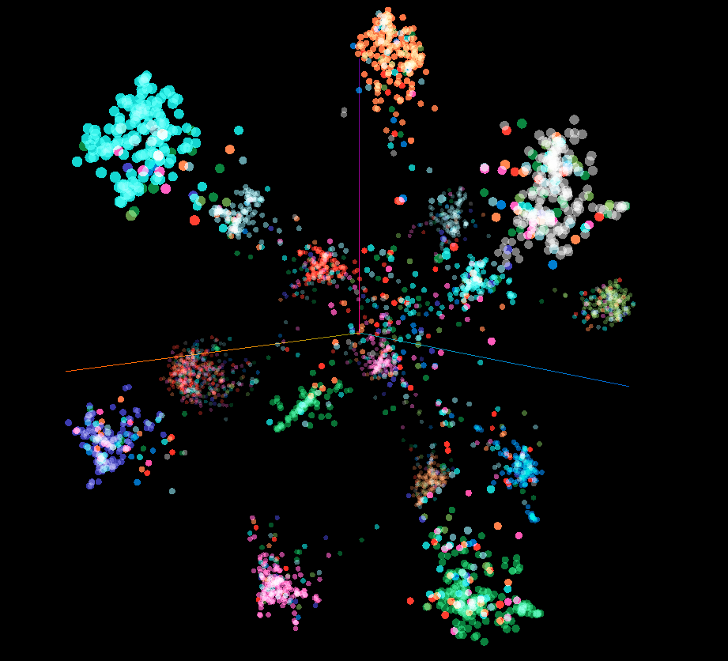

# Farm Animal Tracking Project

Project for tracking farm animals.[Sample YT](https://www.youtube.com/watch?v=SEw_Tgrrg_E)

## Prerequisites
* Python >=3.7
* [TensorFlow Object Detection API](https://github.com/tensorflow/models/tree/archive/research/object_detection)

## Instalation
Download repository and install dependencies

```bash
$ git clone https://github.com/burnpiro/farm-animal-tracking.git
$ cd farm-animal-tracking
$ pip install -r requirements.txt
```

### Download detection model weights

1. To download precompiled model weights [Google Drive](https://drive.google.com/file/d/19wD8VsuGlIeBKCbfmmVMBxePn8lCoZJm/view?usp=sharing)
1. Unzip archive to model/detection_model


### Download recognition model weights

1. To download precompiled model weights [Google Drive](https://drive.google.com/file/d/1-HGENW0g-ZvfeWzfemLMPf1Eg9RFuceW/view?usp=sharing)
1. Unzip archive to model/siamese/weights

## Running 

### Detection

To visualize animal detection on video use:
```
$ python show_prediction.py
```
or for image:
```
$ python run_detection.py
```



### Tracking
To visualize animal tracking on video use:
```
$ python show_tracking.py --video=<path to video>
```


## Dataset

Dataset for learning of model can be obtained at [PSRG website](http://psrg.unl.edu/Projects/Details/12-Animal-Tracking).

## EDA (Exploratory Data Analysis)

- Run:
```shell
docker-compose -f eda/docker-compose.yaml up
```
- Go to `localhost:8001` and enter token from console


## Siamese network

You can download current best weights from [Google Drive MobileNetV2](https://drive.google.com/file/d/1-HGENW0g-ZvfeWzfemLMPf1Eg9RFuceW/view?usp=sharing) [Google Drive EfficientNetB5](https://drive.google.com/file/d/1hMCxGOLqZlchUaSSl0UbAD4rbfJ_YFpQ/view?usp=sharing) [Google Drive ResNet101V2](https://drive.google.com/file/d/188y87_OAafZAU_nSA-Ex6OtxlOukAKnY/view?usp=sharing). Put them into `./model/siamese/weights` and use the path as `--weights` parameter.

#### Training

Make sure you have cropped dataset in `./data/cropped_animals` folder. Please check `./data/data_generator.py` documentation for more info.

```
$ python train_siamese.py
```

#### Generate Embeddings for Test dataset and visualize it

Instead of running this script manually (requires ~30GB of RAM) you can use pre-generated train/test/concat files in `./data/visualization`. Just select two files with the same postfix, `vecs-$1.tsv` and `meta-$1.tsv`, it's important to use the same postfix, otherwise length won't match.

```
$ python helpers/generate_siamese_emb_space.py
```

Options:
- `--datatype`: either `train` or `test` (default `train`), which data should be used for embeddings
- `--weights`: string (default `siam-118_0.0633.h5`), specify weights file from `mode/siamese/weights/MobileNetV2/` folder

This is going to produce two files:

- vecs.tsv - list of embeddings for test dataset
- meta.tsv - list of labels for embeddings

You can visualize those embeddings in [https://projector.tensorflow.org/](https://projector.tensorflow.org/) application. Just upload them as a custom data (use `Load` option).

[Average class values - Video](https://www.youtube.com/watch?v=6tjhW4eeVeM)

[Test day data - Video](https://www.youtube.com/watch?v=cW8t12XKssk)

[Train all data - Video](https://www.youtube.com/watch?v=aI6wRRZhFks)



#### Generate tracking data

```
$ cd data
$ python generate_tracking.py
```

This is going to produce tracking data from videos, so we can evaluate model. Look for `frames_tracking.json` and `pigs_tracking.json` inside `./data/tracking/`. For more details check Wiki.


### Testing two images

You can specify the weights for the model. Please use weights marked with the lowest number (loss value).

```
$ python test_siamese.py
```

Options:
```
--weights siam-118_0.0633.h5
```

